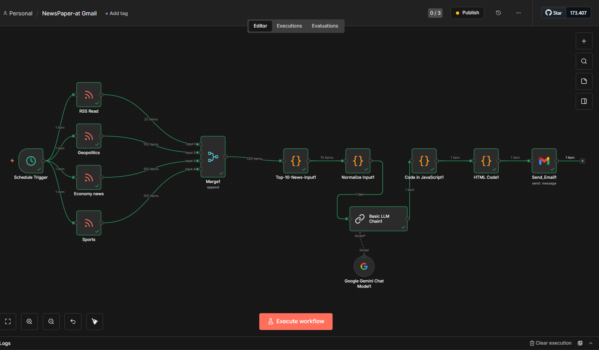
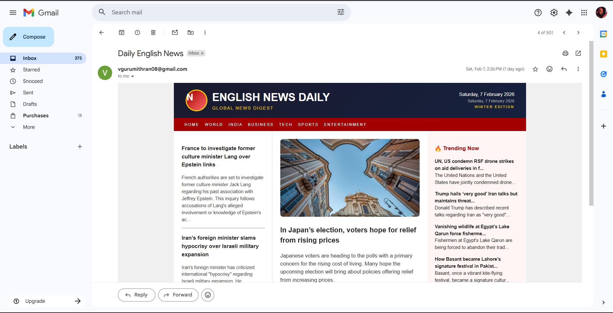

# AI News Automation with n8n

An end-to-end automated news aggregation and newsletter system built using **n8n** and **LLMs**. This workflow fetches news from multiple RSS sources, filters and normalizes the data, generates concise AI-powered summaries, and delivers a clean HTML newsletter automatically.

---

## 🚀 Features

- 🔄 Scheduled news fetching via RSS feeds
- 🧹 Data normalization, filtering, and deduplication
- 🤖 AI-powered news summarization (2–3 sentences per headline)
- 📄 Strict JSON-controlled LLM output
- 🎨 Automated HTML newsletter generation
- 📧 Email delivery using Gmail
- 🌍 Supports English news (can be extended to other languages)

---

## 🛠️ Tech Stack

- **n8n** – Workflow automation
- **JavaScript** – Data processing & merging
- **LLM (Google Gemini / OpenAI compatible)** – News summarization
- **RSS** – News sources
- **HTML & CSS** – Newsletter rendering
- **Gmail API** – Email delivery

---

## 🧩 Workflow Architecture

```
Schedule Trigger
   ↓
RSS Feed Sources (Multiple)
   ↓
Merge & Normalize Data
   ↓
Filter (Last 24 Hours) + Deduplicate
   ↓
AI Summarization (Strict JSON Output)
   ↓
Merge Summaries with Articles
   ↓
HTML Newsletter Generator
   ↓
Email Sender (Gmail)
```

---

## 📸 Sample Output

- Clean, readable English summaries
- Structured newsletter layout
- Mobile-friendly HTML email

  
## 📸 Screenshots

### n8n Workflow


### Newsletter Preview


---

## ⚙️ How to Run Locally

1. Install **n8n** locally
   ```bash
   npm install -g n8n
   n8n start
   ```

2. Import the workflow JSON into n8n

3. Configure credentials:
   - RSS Feed URLs
   - LLM API (Gemini / OpenAI)
   - Gmail account

4. Activate the workflow

---

## 📌 Use Cases

- Daily or hourly news newsletters
- Internal company news briefings
- AI-powered content curation
- Learning project for automation + LLMs

---

## 🔮 Future Improvements

- Multi-language support (Tamil, Hindi, etc.)
- Web dashboard for newsletters
- Image generation for headlines
- Telegram / WhatsApp delivery

---

## 👤 Author

**Gurumithran**

- LinkedIn: *(add link)*
- GitHub: *(add link)*

---

⭐ If you like this project, give it a star!
